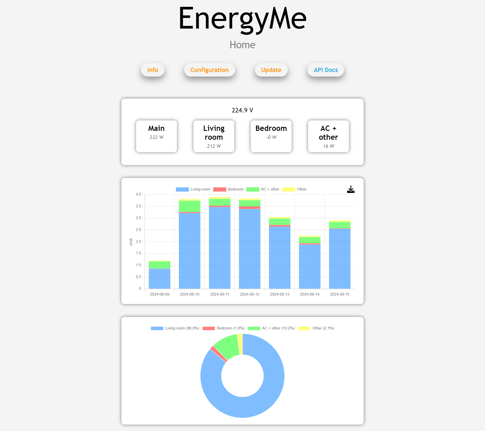

#  EnergyMe-Home

EnergyMe-Home is an open-source energy monitoring system for home use, capable of monitoring up to 17 circuits. It integrates with any platform through REST API, MQTT, Modbus TCP, and InfluxDB.

Built for makers and DIY enthusiasts who want to track their home's energy consumption. The hardware uses ESP32-S3 and ADE7953 energy measurement IC, while the firmware is written in C++ with PlatformIO and Arduino framework. You can build and customize it yourself - all hardware designs and software are open-source.

## Hardware

The hardware (currently at **v5**) consists of both the PCB design and the components used to build the energy monitoring system.

The key components include:

- ESP32-S3: the brain of the project
- ADE7953: single-phase energy measurement IC
- Multiplexers: used to monitor multiple circuits at once
- 3.5 mm jack connectors: used to easily connect current transformers

PCB schematics and BOMs are available in the `documentation/Schematics` directory, while datasheets for key components are in the `documentation/Components` directory. Additional hardware specifications and technical details can be found in the [`documentation/README.md`](documentation/README.md).

The project is published on *EasyEDA* for easy access to the PCB design files. You can find the project on [EasyEDA OSHWLab](https://oshwlab.com/jabrillo/multiple-channel-energy-meter).

## Software

The firmware is built with C++ using the *PlatformIO* ecosystem and *Arduino 3.x framework*, with a **task-based architecture using FreeRTOS**.

**Key Features:**

- **Energy Monitoring**: ADE7953 driver with energy accumulation and CSV logging
- **Web Interface**: Dashboard for monitoring and system configuration
- **Authentication**: Token-based security with password protection
- **Integration Options**: REST API, MQTT, InfluxDB, and Modbus TCP
- **Crash Recovery**: Automatic recovery and firmware rollback on failures
- **WiFi Setup**: Captive portal for configuration and mDNS support (`energyme.local`)
- **OTA Updates**: Firmware updates with MD5 verification and rollback

For detailed architecture, implementation details, and API documentation, see [`source/README.md`](source/README.md).

## Integration

EnergyMe-Home offers multiple integration options:

- **REST API**: Complete Swagger-documented API for all data and configuration ([swagger.yaml](source/resources/swagger.yaml))
- **MQTT**: Publish energy data to any MQTT broker with optional authentication
- **Modbus TCP**: Industrial protocol for SCADA systems integration
- **InfluxDB**: Support for both v1.x and v2.x with SSL/TLS and buffering
- **Home Assistant**: Dedicated custom integration ([homeassistant-energyme](https://github.com/jibrilsharafi/homeassistant-energyme))

For detailed integration guides and implementation details, see the [documentation](documentation/README.md).

## Home Assistant Integration

EnergyMe-Home integrates with Home Assistant through a dedicated custom integration.

- **Setup**: Requires device IP address (automatic discovery via mDNS coming soon)
- **Data**: All energy measurements and system information as Home Assistant entities
- **Access**: Monitor all circuits and aggregate data within Home Assistant

Get started at [homeassistant-energyme](https://github.com/jibrilsharafi/homeassistant-energyme).

## Getting Started

1. **Order the PCB**: Download the design files from the [Schematics folder](documentation/Schematics/) and order from your preferred PCB manufacturer
2. **Populate the board**: Solder all components using the BOM in `documentation/Schematics`
3. **Flash the firmware**: Connect a USB-to-UART adapter to the UART pins and flash using PlatformIO
4. **Configure WiFi**: Power on the device and connect to the captive portal to set up WiFi credentials
5. **Start monitoring**: Access the web interface at `http://energyme.local` (default credentials: *admin*/*energyme*)

For detailed build instructions and troubleshooting, see the [documentation](documentation/README.md).

## Contributing

Contributions are welcome! Please read the [contributing guidelines](CONTRIBUTING.md) for more information.

## License

This project is licensed under the terms of the GNU General Public License v3.0. See the [LICENSE](LICENSE) file for details.
