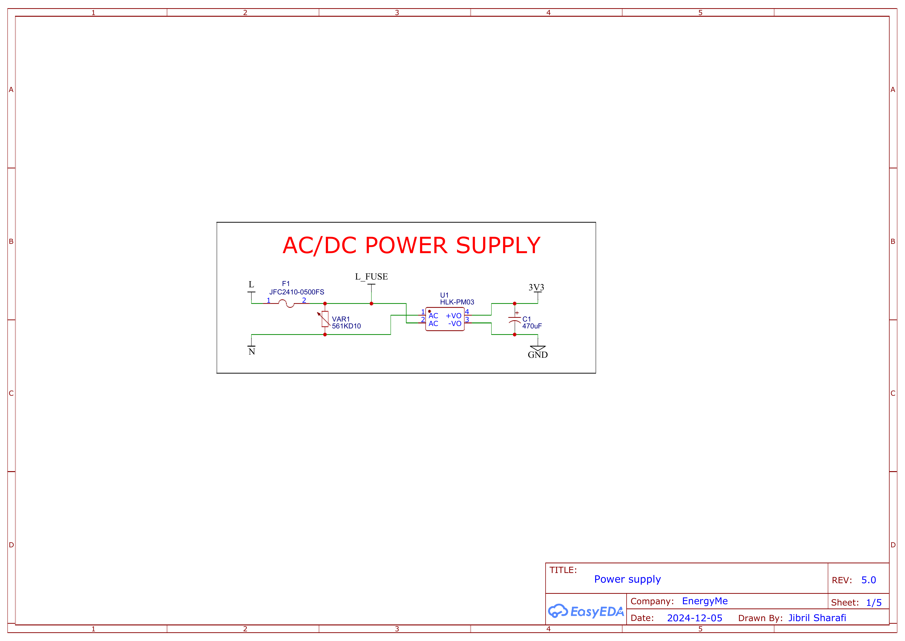
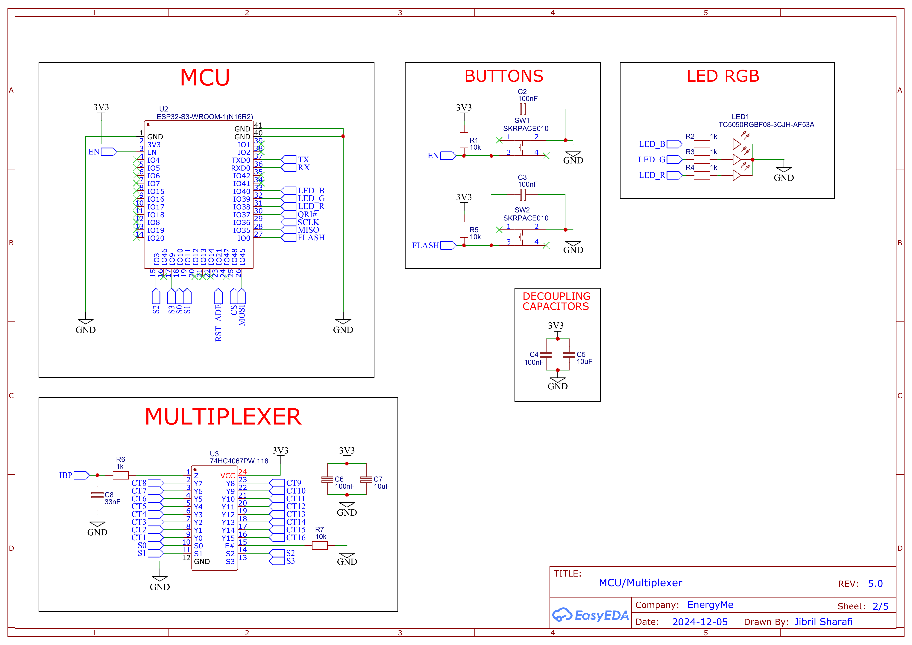
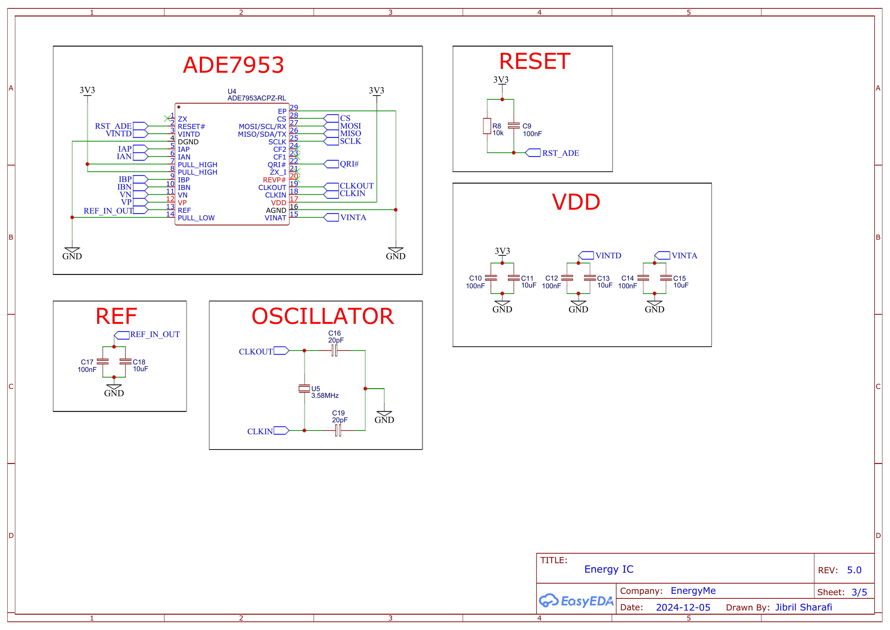
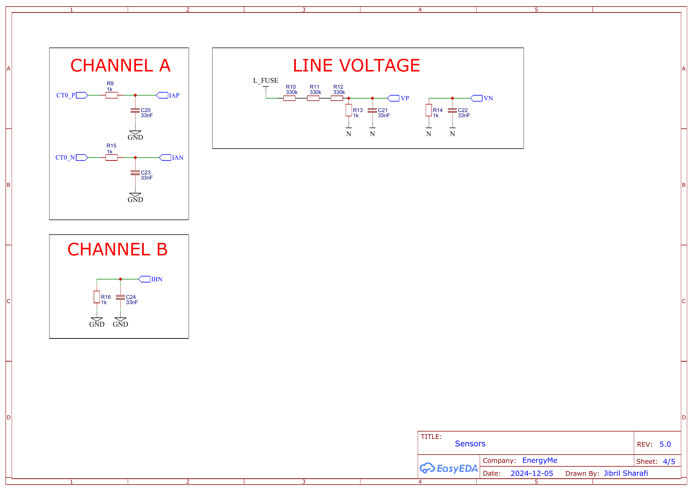
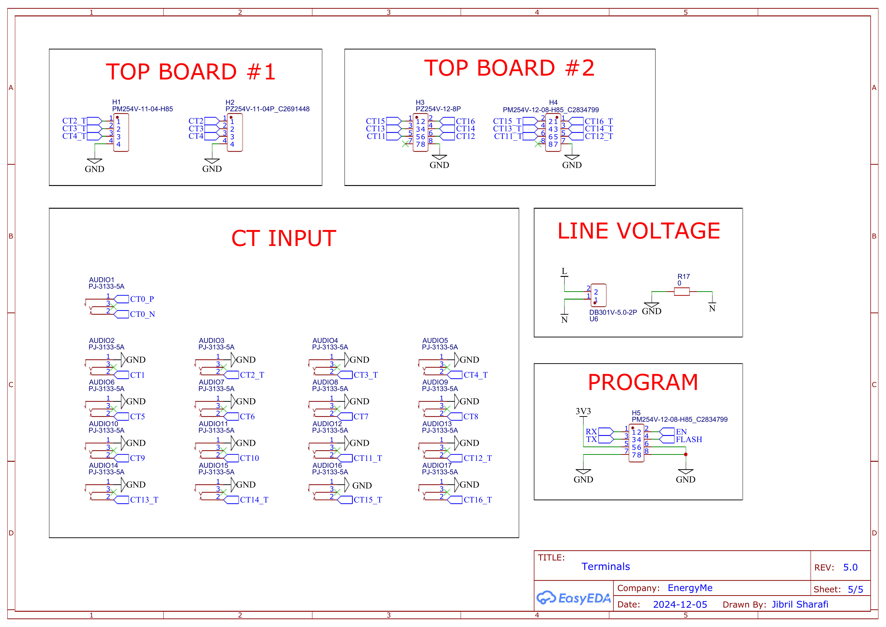
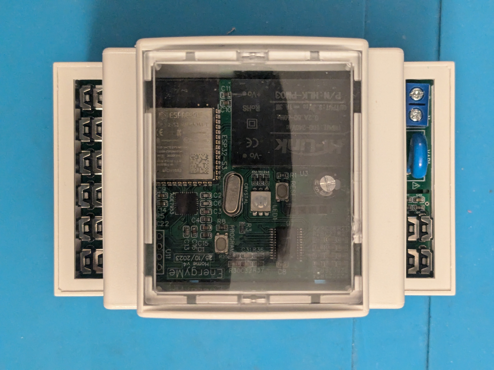
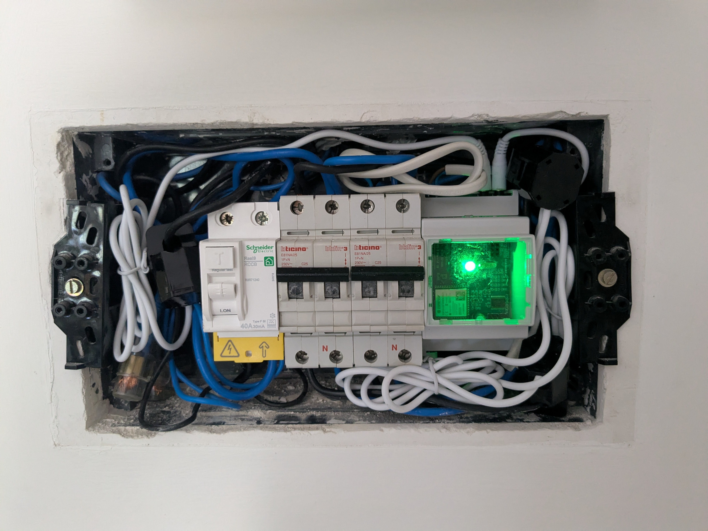

# EnergyMe-Home Hardware Documentation

This document provides detailed hardware specifications and technical information for the EnergyMe-Home PCB design. For general project information, software features, and integrations, see the [main README](../README.md).

## Hardware Specifications

**Board Information:**

- **Hardware Revision:** v5
- **PCB Layers:** 4 layers
- **Board Dimensions:** 87 mm x 50 mm. Height with components around 15 mm
- **Power Consumption:** ~100 mA @ 3.3V typical (< 1W AC consumption)

**Key Components:**

- **Main Microcontroller:** ESP32-S3-WROOM-1-N16R2 (dual-core, WiFi 2.4 GHz, 16MB Flash, 2MB PSRAM)
- **Energy Measurement IC:** Analog Devices ADE7953ACPZ-RL (single-phase, dual-channel)
- **ADE7953 Crystal:** 3.58 MHz oscillator (S1C35800ZWJAC)
- **Analog Multiplexer:** 74HC4067PW,118 (16-channel, TSSOP-24)
- **CT Inputs:** 17× PJ-3133-5A 3.5mm stereo jacks (1 direct + 16 multiplexed)
- **Voltage Divider:** 1000:1 ratio (1 MΩ / 1 kΩ) for AC mains reference
- **Power Supply:** HLK-PM03 AC/DC module (100-240 VAC to 3.3 VDC, 1A max)

**ESP32-S3 Module Compatibility Notes:**

The design uses ESP32-S3-WROOM-1-N16R2 with quad PSRAM (2MB). Other ESP32-S3 variants may work with `platformio.ini` and partition adjustments, but note:

- **N16R8 (8MB Octal PSRAM)**: ⚠️ **Not compatible** - Octal PSRAM uses GPIOs 35, 36, 37 which conflict with ADE7953 SPI (MISO=35, SCK=36, IRQ=37)
- **N16R0, N8R0, N4R0 (No PSRAM)**: May work but not recommended - PSRAM used for queues and JSON documents throughout the code
- **N16R2, N8R2, N4R2 (2MB Quad PSRAM)**: Should work with partition table adjustments. Compiled firmware ~2MB (see [issue #21](https://github.com/jibrilsharafi/EnergyMe-Home/issues/21))

**Future Hardware Revision Considerations:**

For improved module compatibility in future revisions, consider relocating pins to avoid conflicts:

- Avoid GPIOs 35, 36, 37 (used by octal PSRAM in N16R8/N8R8 modules)
- Consider GPIO 47 as an alternative to GPIO 45 (it is suggested to avoid pins 45 and 46)

## Circuit Design Overview

### 1. Power Supply Unit

*HLK-PM03* AC/DC module providing 3.3V DC from universal AC input (100-240 VAC, 50-60 Hz). Includes 470µF bulk capacitor and protection components (fuse, varistor, PCB slots).

### 2. Microcontroller (ESP32-S3)

*ESP32-S3-WROOM-1-N16R2*: the central processing unit managing all digital logic, SPI communication with ADE7953, multiplexer control, LED control, and wireless connectivity.

### 3. Energy Measurement (ADE7953)

High-precision 24-bit energy metering IC (*ADE7953ACPZ-RL*) with dual current channels, clocked by 3.58 MHz crystal:

- **Channel A:** Direct CT input for main circuit monitoring
- **Voltage Input:** AC mains reference via 1000:1 voltage divider (1 MΩ / 1 kΩ)
- **Channel B:** Multiplexed input from 16 branch circuits
- **Communication:** SPI interface to ESP32-S3

### 4. Analog Multiplexing

*74HC4067PW,118* multiplexer routes one of 16 CT signals to ADE7953 Channel B. ESP32-S3 controls select lines (S0-S3) for sequential measurement.

### 5. CT Interface & Other Inputs

All 17 CT inputs use PJ-3133-5A 3.5mm stereo jacks with direct connection through low-pass filters (1 kΩ / 33 nF). **Maximum CT output: 333 mV**. No burden resistors are present on the board.

The line voltage is fed via a 2.54mm 2-pin screw terminal block, rated for 300V/3A.

The programming header is a standard 2x5 2.54mm pin header, comprising of 3V3, GND, EN, IO0, TX, RX pins.

Two more headers are available for expanding the CT inputs up to 17 total channels (the bare board has 8 channels).

## PCB Layout & Design

The main board features a **4-layer PCB** design optimized for mixed-signal operation with careful attention to analog/digital separation and power distribution.

**Layer Stack-up:**

- **Layer 1 (Top):** Signal routing, components, ground stitching
- **Layer 2:** Ground plane (continuous pour for low impedance)
- **Layer 3:** Power plane (3.3V distribution)
- **Layer 4 (Bottom):** Signal routing

**Component Placement:**

- **Power section** isolated on top-left side with HLK-PM03 AC/DC module (though no galvanic isolation is provided as the neutral line is connected to the board ground)
- **ESP32-S3** positioned on the left side, leaving a slot under the the PCB antenna on the module to improve WiFi performance
- **ADE7953** placed close to the ESP32-S3 to minimize SPI trace lengths
- **Multiplexer** positioned close to the ADE7953 to reduce analog signal path lengths
- **CT jacks** arranged in rows along board edges for easy access
- **RGB LED** near the center for status indication
- **Programming header** located at the center for easier access
- **Expansion headers** near the CT jacks for additional channels

**Manufacturing Specifications:**

- Minimum trace width: 0.127mm
- Minimum trace spacing: 0.127mm
- Minimum via size: 0.25mm
- Minimum via drill: 0.15mm
- Surface finish: HASL or ENIG recommended
- Solder mask: Required (typically green)
- Silkscreen: Component designators and polarity markings

## Design Files & Resources

- **EasyEDA Project:** [Multiple Channel Energy Meter](https://oshwlab.com/jabrillo/multiple-channel-energy-meter)
- **Schematics:** Available in `Schematics/` directory
- **BOM:** `Schematics/BOM.csv`
- **Gerber Files:** Multiple board variants in `Schematics/`
- **Component Datasheets:** Available in `Components/` directory

## Safety & Assembly Notes

⚠️ **ELECTRICAL SAFETY WARNING**

This device interfaces with AC mains voltage. Construction and installation must only be performed by qualified individuals with proper knowledge of electrical safety. Improper handling can result in serious injury or death.

**Assembly Requirements:**

- SMD soldering skills and appropriate tools (hot air station, fine-tip iron)
- Use voltage-output CTs rated for 333mV maximum output
- Follow proper electrical isolation and safety procedures

## Hardware Images

**Bare PCB:**

**Assembled Board:**

**Enclosure:**

**Installation:**

