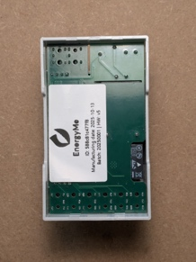
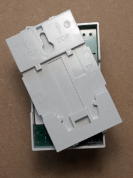
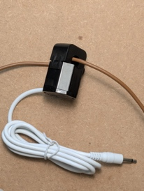

# Installation Manual

EnergyMe

Thank you for choosing EnergyMe.

EnergyMe is the solution for monitoring energy consumption in your home
or office.

## READ BEFORE STARTING

This is a kit for developers and enthusiasts. Installation requires
electrical skills.

⚠️ RISK OF ELECTRIC SHOCK: Installation must be carried out on the main
electrical panel. Always turn off the main breaker before touching any
cables, and do not turn it back on until the installation is completely
finished.

⚙️ CONSULT AN EXPERT: If you are not familiar with electrical panels, do
not proceed. Ask for help from a qualified electrician or an experienced
friend. I am not responsible for any damage to persons or property
resulting from incorrect installation.

🔌 PHASE/NEUTRAL CONNECTION: It is essential to connect the phase (L)
and neutral (N) terminals as indicated on the board:

• PHASE (L): Left terminal (outermost)  
• NEUTRAL (N): Right terminal

An incorrect connection may damage the device.

⚡ CLOSE EVERYTHING BEFORE POWERING UP: Make sure all current
transformers (CTs) are connected and all terminal covers are installed
before restoring power to the system.

## Box Contents

- 1 Installation Manual

- 1 Electronic board

- 1 DIN-compliant case for mounting in the electrical panel

<!-- -->

- 1 Gray upper part

- 1 Gray lower part

- 2 Gray terminal covers

- 1 Black fixing clip

- 1 Transparent window

<!-- -->

- 1 Current transformer (CT) 50A

- 3 Current transformers (CT) 30A

## Physical Installation

Take the gray upper part of the case.

Turn it upside down, keeping the rectangular hole (for the black clip)
facing down.

Take the electronic board and rotate it along the vertical axis.

Gently insert the bottom part (with the 6 jack connectors) into the
case.

At this point, you should have the rectangular hole for the black clip
facing downward.

Take the bottom part of the case and keep the 'TOP' label facing up (the
rectangular holes of both parts must align below).

This is what you should have.

Insert the black clip with the flat side against the bottom of the case,
pressing down until you hear a click.

## Connecting the CTs

Connect the clamp labeled 50A to the connector Audio 1 (Channel 0),
connect one of the 30A clamps to Audio 2 (Channel 1), connect the
remaining two clamps to Audio 6 (Channel 5) and Audio 7 (Channel 6).

Map of correspondence between names printed on the logic board and
logical channels (Channel) of the software.

## Installing in the Electrical Panel

⚠️ Disconnect power from the entire electrical panel.

Mount the assembled module inside the panel.

Open the CTs and clip them around the cables of the circuits you want to
monitor. Make sure you hear the click when they close. Insert the jacks
into the main unit. Install the 50A CT on the main breaker, and the 30A
CTs on the other breakers you wish to monitor.

Connect the power supply: PHASE (L): Left terminal (outermost) NEUTRAL
(N): Right terminal, ensure the phase wire (brown, black, or gray) is on
the left (marked L) and the neutral wire (blue) is on the right (marked
N).

⚠️ Only after verifying all connections, restore power to the system.

Install the upper terminal cover.

Install the lower terminal covers.

Place the transparent window.

## Connecting to Your Network

On your smartphone, scan the QR code on the device to connect to its
Wi-Fi network (EnergyMe-XXXXXX), or manually connect to the Wi-Fi SSID
EnergyMe-XXXXXX.

Once connected, a browser page will open automatically.

If it does not, open your browser and go to http://192.168.4.1. Ensure
you are connected to the Wi-Fi EnergyMe-XXXXXX.

Select your home Wi-Fi SSID, enter your password, and save. The device
will restart and connect to your home Wi-Fi.

The LED visible through the transparent window should now be green.

## Configuration

From any device connected to the same network (smartphone or PC), go to
http://energyme.local.

If that doesn’t work, find the device’s IP address (for example, in your
router’s configuration page) and connect directly using that IP.

Default credentials: Username: admin / Password: energyme, Change the
password immediately!

Go to the Info page and take a screenshot (it contains useful
information).

Go to Configuration → Channel.

Modify the Labels as you prefer so they match Channels 0, 1, 5, and 6.

Enable the channels using the Active checkbox for Channels 0, 1, 5, and
6.

If you see negative values, enable the Reverse checkbox.

Return to the main page and enjoy monitoring your home’s energy usage!

## Need Help?

Full documentation, advanced guides, and FAQs:
github.com/jibrilsharafi/EnergyMe-Home

Project updates: energyme.net

Support and questions: jibril.sharafi@gmail.com
