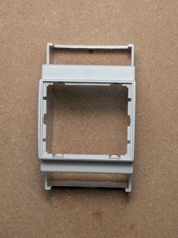
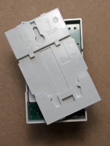

# Assemblaggio Hardware

Questa guida ti accompagnerà nell'assemblaggio del case del dispositivo EnergyMe. Questa fase è **sicura per tutti** - non sono coinvolti lavori elettrici.

## Cosa Ti Serve

Dalla scatola EnergyMe:

- 1 Scheda elettronica
- 1 Parte superiore del case grigia
- 1 Parte inferiore del case grigia
- 1 Clip nera di fissaggio
- 1 Vetrino trasparente
- 1 Trasformatore di corrente (TA) da 50A/333mV
- 3 Trasformatori di corrente (TA) da 30A/333mV

## Passo 1: Preparare la Parte Superiore del Case

Prendi la parte superiore grigia del case.

Girala capovolgendola, avendo cura di tenere sotto il buco rettangolare dove passerà la clip nera.

## Passo 2: Inserire la Scheda Elettronica

Prendi la scheda elettronica e girala lungo la linea verticale.

Inserisci delicatamente prima la parte sotto (quella con i 6 connettori jack) nel case.

A questo punto dovresti avere il buco rettangolare che ospiterà la clip nera sempre rivolto verso il basso.

## Passo 3: Fissare la Parte Inferiore del Case

Prendi il fondo del case e rivolgi la scritta TOP in alto. I rettangoli dove passerà la clip nera di entrambe le parti devono coincidere sotto.

Questo è quello che dovresti avere prima di installare la clip.

## Passo 4: Installare la Clip di Fissaggio

Inserisci la clip nera avendo cura di mettere la parte piatta a contatto con il fondo del case, spingendo verso il basso fino a sentire un clic.

## Riferimento Mappa Canali

Questo diagramma mostra la corrispondenza tra i nomi stampati sulla scheda logica e i canali logici del software.

---

## ✅ Assemblaggio Hardware Completato

Il tuo dispositivo EnergyMe è ora assemblato e pronto per l'installazione elettrica.

**Prossimo Passo**: [Installazione Elettrica](02-installazione-elettrica.md)

⚠️ **Attenzione**: Il prossimo passo richiede lavori sul quadro elettrico e competenze elettriche.
