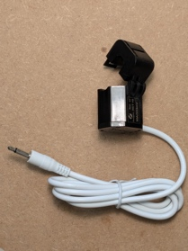
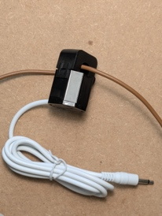
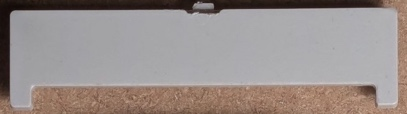

# Installazione Elettrica

⚠️ **ATTENZIONE: Questa sezione richiede lavori con l'impianto elettrico. Se non hai esperienza o non ti senti sicuro, consulta un elettricista qualificato.**

## Precauzioni di Sicurezza

🔴 **PRIMA DI INIZIARE**:

- **Stacca l'interruttore generale** - Togli tensione da tutto il quadro elettrico
- **Verifica che non ci sia corrente** - Usa un tester di tensione per confermare
- **Non riattivare la corrente** finché TUTTI i passaggi dell'installazione non sono completi
- **Tieni lontani bambini e animali** dall'area di lavoro

### Collegamento Fase e Neutro

È **fondamentale** collegare correttamente i morsetti:

- **FASE (L)**: Morsetto a sinistra (il più esterno) - Cavo marrone, nero o grigio
- **NEUTRO (N)**: Morsetto a destra - Cavo blu

⚠️ **Un collegamento errato può danneggiare il dispositivo o causare pericoli elettrici.**

## Passo 1: Montare nel Quadro Elettrico

1. Individua uno spazio libero sulla barra DIN nel quadro elettrico (richiesti 3 moduli, o 54mm di larghezza)
2. Aggancia il dispositivo EnergyMe sulla barra DIN
3. Premi verso il basso fino a sentire il clic di aggancio

## Passo 2: Installare i Trasformatori di Corrente

 

### Installare il TA da 50A (Circuito Principale)

1. Apri il trasformatore di corrente da 50A premendo le linguette di rilascio
2. Posizionalo attorno al **cavo del circuito principale**
3. Chiudilo fino a sentire un **clic** - assicurati che sia completamente chiuso
4. Il jack dovrebbe essere già collegato ad Audio 1 (Channel 0) dal passaggio di assemblaggio

### Installare i TA da 30A (Circuiti Individuali)

1. Apri ciascun trasformatore di corrente da 30A
2. Posizionali attorno ai cavi dei circuiti che vuoi monitorare (es. cucina, soggiorno, climatizzazione)
3. Chiudi ciascuno fino a sentire un **clic**
4. I jack dovrebbero essere già collegati ad Audio 2, Audio 6 e Audio 7

**Importante**: Assicurati che tutti i TA siano completamente chiusi prima di procedere.

## Passo 3: Collegare l'Alimentazione

Ora collegherai il dispositivo EnergyMe all'alimentazione di rete:

1. Identifica il **cavo di fase** (L) - solitamente marrone, nero o grigio
2. Identifica il **cavo neutro** (N) - solitamente blu
3. Collegali ai morsetti:
   - **Morsetto sinistro (L)**: Cavo di fase
   - **Morsetto destro (N)**: Cavo neutro
4. Stringi bene le viti dei morsetti

⚠️ **Verifica i collegamenti prima di procedere!**

## Passo 4: Installare i Coprimorsetti

Installa il coprimorsetto superiore.

Installa il coprimorsetto inferiore.

## Passo 5: Installare il Vetrino Trasparente

Posiziona il vetrino trasparente per completare l'installazione.

## Passo 6: Ripristinare l'Alimentazione

1. **Verifica tutti i collegamenti un'ultima volta**
2. **Assicurati che tutti i TA siano completamente chiusi**
3. **Assicurati che i coprimorsetti siano installati**
4. Riattiva l'interruttore generale

### LED di Stato

Guarda attraverso il vetrino trasparente il LED sul dispositivo:

- **Vari colori**: Il dispositivo si sta avviando
- **Blu** pulsante: Il dispositivo è in attesa delle credenziali WiFi
- **Verde** fisso: Il dispositivo è pronto (dopo la configurazione WiFi)

---

## ✅ Installazione Elettrica Completata

Il tuo dispositivo EnergyMe è ora fisicamente installato e alimentato. Ora è il momento di configurare il WiFi e impostare i canali di monitoraggio tramite l'interfaccia web.

**Prossimo Passo**: [Configurazione Software](03-configurazione-software.md)

---

## Risoluzione Problemi

**Il LED non si accende?**

- Verifica che l'interruttore generale sia acceso
- Controlla che i collegamenti di fase e neutro siano corretti e ben fissati
- Verifica che le viti dei morsetti siano strette

**Il LED rimane rosso?**

- È normale durante il primo avvio
- Prosegui con la configurazione software per impostare il WiFi

**Il LED non diventa blu o verde?**

- È normale durante il primo avvio
- Prosegui con la configurazione software per impostare il WiFi
- Se non funziona, riavvia il dispositivo spegnendo e riaccendendo l'interruttore generale oppure premendo con attenzione il pulsante RST con uno strumento non conduttivo (es. una penna di plastica)

---

**Hai bisogno di aiuto?** Contatta: <jibril.sharafi@gmail.com>
