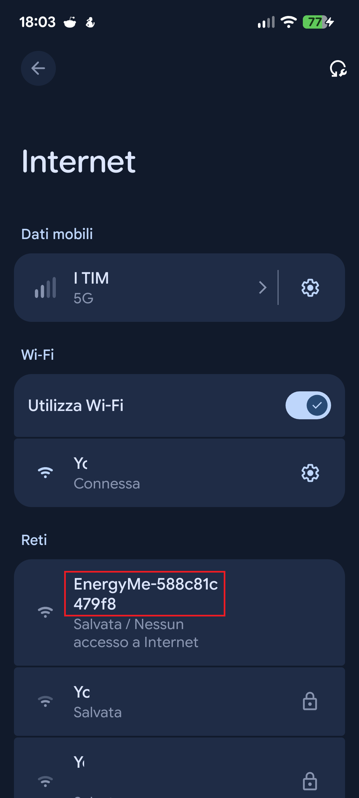
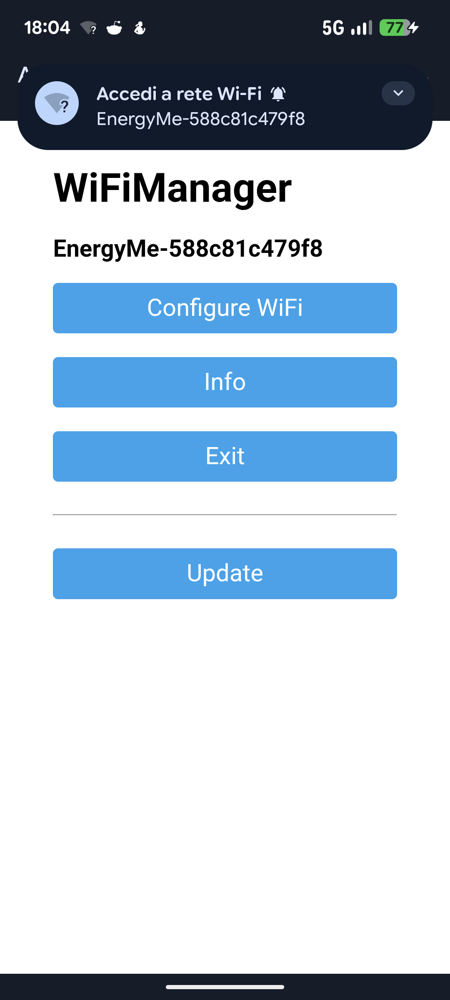
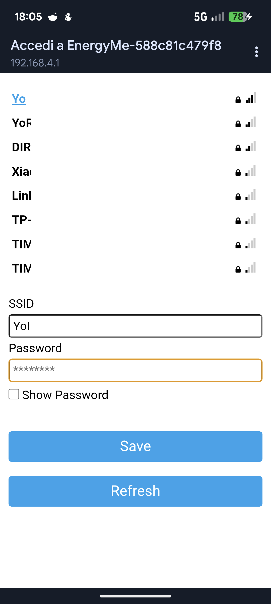
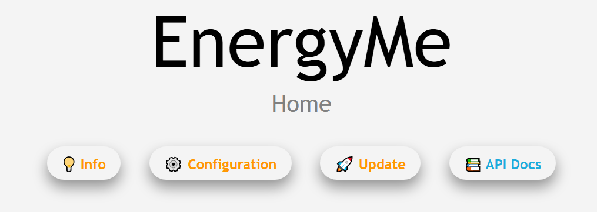
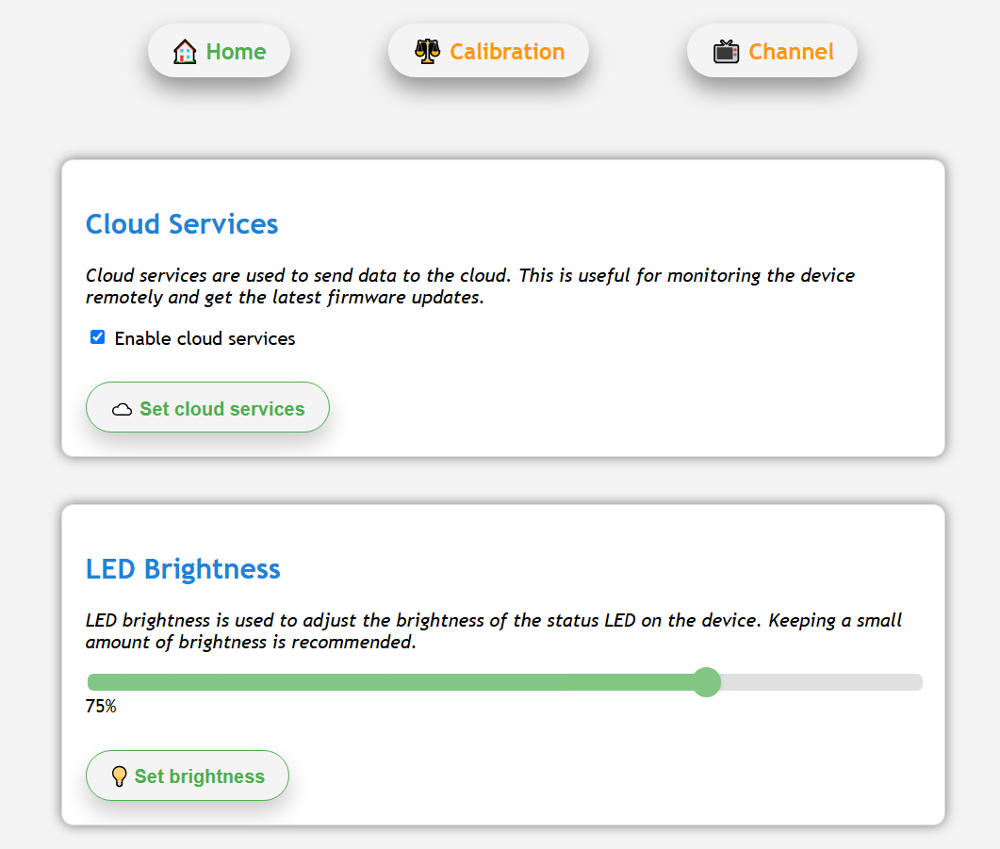
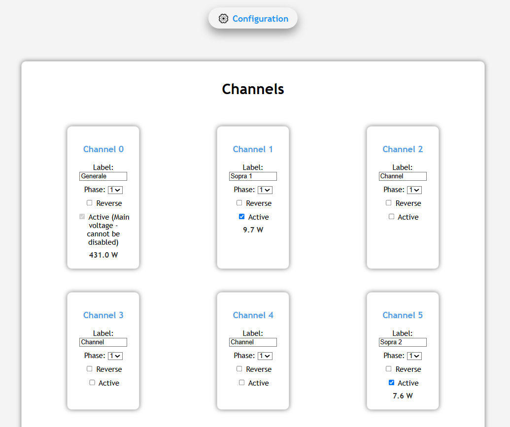

# Configurazione Software

Ora che il tuo dispositivo EnergyMe è fisicamente installato, configuriamolo tramite l'interfaccia web.

## Passo 1: Connessione al WiFi EnergyMe

Per prima cosa, assicurati che il LED stia lampeggiando rapidamente in blu, indicando che è in modalità di configurazione WiFi. Se pulsa lentamente in blu, significa che sta cercando di connettersi a una rete WiFi precedentemente configurata.

### Usando lo Smartphone (Consigliato)

1. **Scansiona il QR code** sul case del tuo EnergyMe - Home
2. Il telefono si connetterà automaticamente alla rete WiFi EnergyMe
3. Una pagina di configurazione dovrebbe aprirsi automaticamente

### Connessione Manuale

Se la scansione non funziona:

1. Apri le impostazioni WiFi sul tuo smartphone o computer
2. Cerca una rete chiamata **EnergyMe-XXXXXX** (XXXXXX = ID unico)
3. Connettiti a questa rete
4. Apri un browser web e vai su: `http://192.168.4.1` (se la pagina di configurazione non si apre automaticamente)

## Passo 2: Configurare il WiFi

Una volta connesso alla rete EnergyMe:

1. Apparirà la pagina di configurazione WiFi
2. **Seleziona la tua rete WiFi di casa** dalla lista
3. **Inserisci la password WiFi**
4. Clicca su **Salva**

Il dispositivo si riavvierà e si connetterà alla tua rete domestica. Attendi circa 30 secondi.

### Indicatore LED di Stato

- **Rosso/Lampeggiante**: Connessione al WiFi in corso
- **Verde**: Connesso con successo

## Passo 3: Accedere all'Interfaccia Web

Ora che EnergyMe è connesso alla tua rete domestica, puoi accedere alla sua interfaccia web.

### Opzione 1: Usando mDNS (Più Facile)

Apri un browser web e vai su: `http://energyme.local`

### Opzione 2: Usando l'Indirizzo IP

Se `energyme.local` non funziona:

1. Trova l'indirizzo IP del dispositivo nell'elenco dei dispositivi connessi del tuo router
2. Cerca un dispositivo chiamato "EnergyMe" o "ESP32"
3. Usa quell'indirizzo IP nel browser (es. `http://192.168.1.123`)

## Passo 4: Login

**Credenziali predefinite:**

- **Username**: `admin`
- **Password**: `energyme`

🔒 **Importante**: Cambia la password immediatamente dopo il primo accesso nella pagina Configuration!

## Passo 5: Configurare i Canali

1. Vai su **Configuration** → **Channel**
2. Vedrai una lista di tutti i 17 canali (0-16)

### Abilitare i Canali Attivi

In base alla tua installazione hardware, abilita i canali che stai usando:

- **Channel 0** (Audio 1): TA 50A - Circuito principale - ✅ Spunta **Active**
- **Channel 1** (Audio 2): TA 30A #1 - ✅ Spunta **Active**
- **Channel 5** (Audio 6): TA 30A #2 - ✅ Spunta **Active**
- **Channel 6** (Audio 7): TA 30A #3 - ✅ Spunta **Active**

Lascia i Canali 2, 3, 4 e 7 **inattivi** (non spuntati).

### Personalizzare le Etichette dei Canali

Assegna a ogni canale un nome significativo:

- **Channel 0**: "Principale" o "Totale"
- **Channel 1**: "Cucina"
- **Channel 5**: "Soggiorno"
- **Channel 6**: "Climatizzazione"

Scegli etichette che corrispondano alla tua installazione reale.

### Correggere i Valori Negativi

Se vedi valori di potenza negativi per qualche canale:

- ✅ Abilita la casella **Reverse** per quel canale
- Questo inverte il calcolo della polarità

### Salvare la Configurazione

I dati vengono salvati automaticamente quando apporti modifiche.

## ✅ Configurazione Completata

Congratulazioni! Il tuo sistema EnergyMe è ora completamente operativo.

Ora puoi:

- Monitorare il consumo di potenza in tempo reale
- Tracciare l'utilizzo energetico per circuito
- Accedere all'interfaccia web da qualsiasi dispositivo sulla tua rete
- Esportare i dati per l'analisi

---

## Risoluzione Problemi

### Non riesco a connettermi a energyme.local

- Prova a usare l'indirizzo IP invece
- Verifica che il tuo dispositivo sia sulla stessa rete
- Alcune reti non supportano mDNS - usa l'indirizzo IP

### Valori di potenza negativi

- Abilita la casella **Reverse** per i canali interessati
- È normale se il TA è stato installato "al contrario"

### Nessuna lettura su un canale

- Verifica che il canale sia contrassegnato come **Active**
- Controlla che il TA sia completamente chiuso attorno al cavo
- Verifica che il jack sia ben collegato
- Prova un canale diverso per testare se il TA funziona

---

## Hai Bisogno di Aiuto?

- **Documentazione**: [github.com/jibrilsharafi/EnergyMe-Home](https://github.com/jibrilsharafi/EnergyMe-Home)
- **Aggiornamenti progetto**: [energyme.net](https://energyme.net)
- **Supporto**: <jibril.sharafi@gmail.com>

**Grazie per aver scelto EnergyMe!** 🎉
