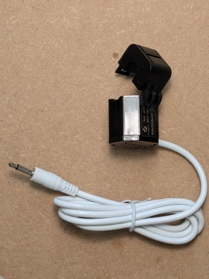

# **Manuale di installazione**

EnergyMe

Grazie per aver scelto EnergyMe.

EnergyMe è la soluzione per il monitoraggio dei consumi per tua casa e
l’ufficio

## LEGGERE PRIMA DI INIZIARE

Questo è un kit per sviluppatori e appassionati. L'installazione
richiede competenze elettriche.

⚠️ RISCHIO DI SCOSSE ELETTRICHE: L'installazione va eseguita sul quadro
elettrico generale. Stacca sempre l'interruttore generale prima di
toccare qualsiasi cavo e non riattivarlo finché l'installazione non è
completamente terminata.

⚙️ RIVOLGITI A UN ESPERTO: Se non hai familiarità con i quadri
elettrici, non procedere. Chiedi aiuto a un elettricista qualificato o a
un amico esperto. Non sono responsabile per danni a persone o cose
derivanti da un'installazione errata.

🔌 COLLEGAMENTO FASE/NEUTRO: È fondamentale collegare la fase (L) e il
neutro (N) ai morsetti come indicato sulla scheda:

- FASE (L): Morsetto a sinistra (il più esterno)

- NEUTRO (N): Morsetto a destra

Un collegamento errato può danneggiare il dispositivo.

⚡ CHIUDI TUTTO PRIMA DI ALIMENTARE: Assicurati che tutti i
trasformatori di corrente (TA) siano collegati e che i coprimorsetti
siano installati prima di ridare corrente all'impianto.

## CONTENUTO DELLA SCATOLA

- 1 questo manuale

- 1 scheda elettronica

- 1 case per il fissaggio a norma DIN per il posizionamento nel quadro
  elettrico

<!-- -->

- 1 parte superiore grigia

- 1 parte inferiore grigia

- 2 copri morsetti grigi

- 1 clip nera di fissaggio

- 1 vetrino trasparente

<!-- -->

- 1 trasformatore di corrente da 50A

- 3 trasformatori di corrente da 30A

## Installazione fisica

Prendere la parte superiore del case grigia.

Girarla avendo cura di tenere sotto il buco rettangolare dove passerà la
clip nera.

Prendere la scheda elettronica e girarla lungo la linea verticale.

Inserire prima la parte sotto (quella con i 6 connettori jack)
delicatamente inserirla nel case.

Questo è quello che dovreste avere a questo punto (il buco rettangolare
che ospiterà la clip nera è sempre sotto).

Prendere il fondo del case rivolgete la scritta TOP in alto (i
rettangoli dove passerà la clip nera di entrambe le parti deve
coincidere sotto).

Questo è quello che dovreste avere.

Inserite la clip nera avendo cura di mettere la parte piatta a contatto
con il fondo del case spingete verso il basso fino a sentire clic.

## Connessione dei TA

Collegate la pinza con scritto sopra 50A al connettore denominato Audio
1 (Channel 0), di seguito una delle pinze con scritto sopra 30A al
connettore Audio 2 (Channel 1), le restanti due ai connettori denominati
Audio 6 (Channel 5) e Audio 7 (Channel 6).

Mappa di corrispondenza tra nomi stampati sulla scheda logica e canali
(Channel) logici del software.

## Installazione nel quadro elettrico

⚠️ Togli la tensione da tutto il quadro elettrico.

Installa il modulo montato nel quadro elettrico.

Apri i trasformatori (TA) e agganciali attorno ai cavi dei circuiti che
vuoi monitorare. Assicurati di sentire il clic di chiusura. Inserisci i
jack nell'unità centrale.

Installa il TA da 50A sull’interruttore generale del tuo quadro, mentre
quelli da 30A sugli altri interruttori che vuoi monitorare.

Collegate l’alimentazione FASE (L): Morsetto a sinistra (il più esterno)
NEUTRO (N): Morsetto a destra, assicurandoti di collegare la fase (cavo
marrone, nero o grigio) a sinistra (scritta L) e il neutro (cavo blu) a
destra (scritta N).

⚠️ Solo dopo aver verificato tutti i collegamenti, ridai corrente
all'impianto elettrico.

Posizionate il copri morsetti superiore.

Posizionate il copri morsetti inferiore.

Posizionate il vetrino trasparente.

## Connessione alla tua rete

Sul tuo smartphone, scansiona il QR code presente sul dispositivo per
connetterti alla sua rete Wi-Fi (EnergyMe-XXXXXX) o vai nelle proprietà
di rete, cerca e collegati la rete Wi-Fi con SSID EnergyMe-XXXXXX.

Una volta connesso, si aprirà una pagina nel browser.

Se non dovesse aprirsi da sola una pagina nel browser, naviga alla
pagina http://192.168.4.1. Assicurati sempre di essere collegato al
Wi-Fi con SSID EnergyMe-XXXXXX.

Seleziona l’SSID della rete Wi-Fi di casa tua, inserisci la password e
salva. Il dispositivo si riavvierà e si connetterà al Wi-Fi di casa tua.

Il LED visibile attraverso il vetrino trasparente dovrebbe essere verde.

## Configurazione

Da qualsiasi dispositivo connesso alla stessa rete (smartphone o PC),
vai su http://energyme.local o, se non dovesse funzionare, trova l’IP
del dispositivo (ad esempio, tramite la pagina di configurazione del tuo
router) e connettiti direttamente utilizzando l’indirizzo IP.

Le credenziali di default sono Username: admin / Password: energyme,
ricordati di cambiare subito la password!

Vai sulla pagina info e fai un screenshot salvalo (potrebbe servirti,
contiene tante informazioni utili)

Vai su configuration → Channel

Modifica le Label a tuo piacimento in modo che rispecchi la posizione di
Channel 0, 1, 5 e 6

Attiva i canali tramite la casella *Active*, Channel 0, 1, 5 e 6.

Se vedi dei valori negativi abilita la casella *Reverse*.

Torna alla pagina iniziale e goditi il monitoraggio energetico della tua
casa!

## Hai bisogno di aiuto?

Per la documentazione completa, guide avanzate e FAQ:
github.com/jibrilsharafi/EnergyMe-Home.

Per rimanere aggiornato sul progetto, visita energyme.net

Per qualunque dubbio o per avere supporto, contatta
jibril.sharafi@gmail.com
